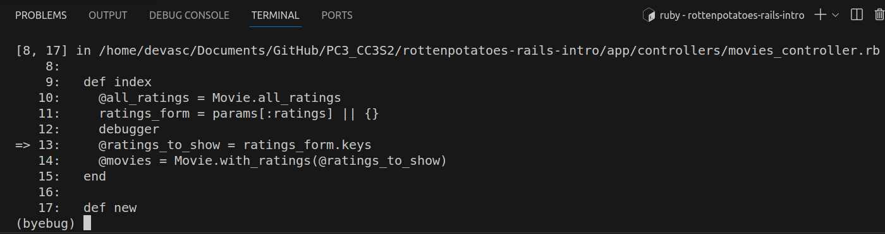

**Informe Paso a Paso: Desarrollo en Rails para RottenPotatoes** 
   
**Video demostrativo**

https://drive.google.com/drive/folders/1cd5M5LOtt6rGbb07TGTcremMFvZfnocB?usp=sharing

## Parte 0: Configuracion 

**Paso 1: Clonar el Repositorio**

Primero, hemos clonado el repositorio RottenPotatoes desde GitHub a nuestro directorio de trabajo. Para ello, ejecutamos el siguiente comando en la terminal:

```bash
git clone https://github.com/saasbook/rottenpotatoes-rails-intro
```


**Paso 2: Configurar Nuestra Rama en GitHub**

Después de clonar el repositorio, necesitamos configurar nuestra propia rama para realizar ediciones. Utilizamos los siguientes comandos, reemplazando `<GITHUB_USERNAME>` con nuestro nombre de usuario de GitHub:

```bash
cd rottenpotatoes-rails-intro
git checkout -b <GITHUB_USERNAME>
git push -u origin <GITHUB_USERNAME>
```


**Paso 3: Configuración Inicial**

En el directorio raíz de la aplicación, nos aseguramos de tener todas las gemas necesarias instaladas ejecutando el siguiente comando:


```bash
bundle install --without production
```


Luego, realizamos la migración inicial para crear la base de datos:

```bash
bin/rake db:migrate
```


**Preguntas y Respuestas**

1. **¿Cómo decide Rails dónde y cómo crear la base de datos de desarrollo?**

   Rails utiliza la configuración en el subdirectorio `config` para determinar cómo y dónde crear la base de datos de desarrollo. La información específica se encuentra en el archivo `config/database.yml`.

   

2. **¿Qué tablas se crearon mediante las migraciones?**

   Las migraciones se encuentran en el subdirectorio `db/migrate`. Hemos inspeccionado estos archivos para determinar qué tablas se crearon. Por lo general, cada migración crea o modifica una tabla.

   

**Paso 4: Insertar Datos Semilla**

Hemos añadido datos iniciales a la base de datos utilizando el siguiente comando:

```bash
bin/rake db:seed
```


**Pregunta 3: ¿Qué datos de semilla se insertaron y dónde se especificaron?**

 El archivo `db/seeds.rb` contiene el dato de semilla insertados que se cargarán en la base de datos cuando ejecutamos bundle exec rake db:seed.


Como se observa en el archivo, se creara varias películas con sus títulos, clasificaciones y fechas de lanzamiento. 

**Paso 5: Ejecutar la Aplicación Localmente**

Ahora, podemos ejecutar la aplicación localmente. Utilizamos el siguiente comando para iniciar el servidor:

```bash
bin/rails server
```

Visitamos la aplicación desde nuestro navegador en `http://localhost:3000` para asegurarnos de que esté funcionando correctamente.

 

### Despliegue Inicial en Heroku con Render

**Paso 1: Iniciar Sesión en Heroku**

En primer lugar, hemos iniciado sesión en nuestra cuenta de Heroku utilizando el siguiente comando en la terminal:

```bash
heroku login -i
```

**Paso 2: Agregar Heroku como Remoto**

A continuación, hemos agregado Heroku como remoto a nuestro repositorio de git. Utilizamos los siguientes comandos, reemplazando `<xx>` con el número de nuestro equipo:

Empezamos creando la app de nombre su23-chips53-2 con el comando 
```
heroku create su23-chips53-4.
```


Luego procedemos a usar los siguientes comandos heroku apps:favorites:add -a su23-chips53-4, para añadir a favoritos la aplicación en Heroku y heroku git:remote -a su23-chips53-4 para agregarle un control remoto de Heroku a mi repositorio de Git. 

```bash
heroku apps:favorites:add -a su23-chips53-<xx>
heroku git:remote -a su23-chips53-<xx>
```


Para verificar que todo este proceso se ha realizado correctamente, se ejecuta el siguiente comando:


**Paso 3: Ajustar la Configuración de Heroku Stack**

Dado que Heroku ha cambiado su entorno, hemos ajustado la configuración del stack para utilizar Ruby 2.6.6 mediante el siguiente comando:

```bash
heroku stack:set heroku-20
```


**Paso 4: Realizar la Primera Implementación en Heroku**

Para llevar a cabo la primera implementación en Heroku, volvimos a nuestra rama maestra y ejecutamos los siguientes comandos:

```bash
git checkout master
git push heroku master
```
´


Es posible que hayamos visto una advertencia la primera vez. Respondimos "sí" para continuar.


## Parte 1: Filtrar lista de peliculas por clasificación

**Paso 1: Actualización del Formulario en `index.html.erb`**

Hemos mejorado RottenPotatoes permitiendo al usuario filtrar la lista de películas por clasificación MPAA. En el archivo `app/views/movies/index.html.erb`, hemos integrado el formulario que incluye casillas de verificación para cada clasificación MPAA.

```erb
<%= form_tag movies_path, method: :get, id: 'ratings_form' do %>
  <% @all_ratings.each do |rating| %>
    <div class="form-check form-check-inline">
      <%= label_tag "ratings[#{rating}]", rating, class: 'form-check-label' %>
      <%= check_box_tag "ratings[#{rating}]", "1", @ratings_to_show.include?(rating), class: 'form-check-input' %>
    </div>
  <% end %>
  <%= submit_tag 'Refresh', id: 'ratings_submit', class: 'btn btn-primary' %>
<% end %>
```
Este código genera un formulario interactivo con casillas de verificación para cada clasificación MPAA. Al marcar las casillas deseadas y hacer clic en el botón "Refresh", el usuario puede filtrar la lista de películas según las clasificaciones seleccionadas.  


En la ejecución local de la aplicación, se ha identificado un error relacionado con la variable @all_ratings, que no está siendo inicializada como una colección. Este problema se manifiesta cuando se intenta iterar sobre @all_ratings en la vista index.html.erb utilizando el método each.


Para abordar este problema, se propone la implementación de un método de clase en el modelo Movie que devuelva la colección de todas las clasificaciones posibles. Este método se llama all_ratings y se encuentra en el archivo `movie.rb`


**Paso 2: Configuración del Controlador**

En el controlador, hemos configurado la variable de instancia `@all_ratings` para contener todas las posibles clasificaciones MPAA utilizando el método de clase `Movie.all_ratings`. Además, hemos configurado la variable `@ratings_to_show` para contener las clasificaciones que deben marcarse, incluso si no se selecciona ninguna casilla.

```ruby
class MoviesController < ApplicationController
  before_action :set_ratings

  def index
    @movies = Movie.with_ratings(@ratings_to_show)
  end

  private

  def set_ratings
    @movie = Movie.all
    @all_ratings = Movie.all_ratings
    @ratings_to_show = params[:ratings] || @all_ratings
  end
end
```
Una vez configurado los archivos mencionados, se ejecuto nuevamente localmente la apliación y podemos observar que ya no tenemos ningun error y se puede observar las casillas.


**Pregunta: ¿Por qué el controlador debe configurar un valor predeterminado para @ratings_to_show incluso si no se marca nada?** 


El controlador configura un valor predeterminado para @ratings_to_show para evitar posibles errores en la vista. Cuando el usuario carga la página por primera vez o no selecciona ninguna casilla, params[:ratings] es nil. Al establecer @ratings_to_show en params[:ratings] || @all_ratings, aseguramos un valor predeterminado (@all_ratings) para evitar errores al usar el método include? en la vista. Esto garantiza un comportamiento consistente y previene problemas cuando no se proporcionan clasificaciones específicas en la solicitud.


### Filtrar por Clasificación en el Modelo

**Paso 3: Método de Clase en el Modelo `Movie`**

Hemos añadido un método de clase `with_ratings` en el modelo `Movie` que filtra las películas según las clasificaciones proporcionadas.

```ruby
class Movie < ActiveRecord::Base
  def self.with_ratings(ratings_list)
    return all if ratings_list.blank?

    where(rating: ratings_list)
  end
end
```

Este método utiliza el método `where` de ActiveRecord para filtrar las películas basándose en las clasificaciones proporcionadas.Así como se observa a continuación:


Pero vemos que aun no nos muestra las peliculas por su clasificacion, es por esto que se modificó el controlador asociado para incorporar este nuevo método de clase en el modelo. En el controlador, se accede a las clasificaciones seleccionadas a través de la variable @ratings_to_show, que se obtiene de los parámetros de la URL.


Aquí, @all_ratings se utiliza para proporcionar una lista de todas las clasificaciones posibles a la interfaz de usuario. Las clasificaciones seleccionadas se obtienen de @ratings_to_show, y luego se utiliza el método with_ratings del modelo Movie para obtener las películas filtradas según esas clasificaciones.

Ahora si vemos que si se filtran las peliculas segun sus calificaciones:


### Mejoras Adicionales

Después de implementar la funcionalidad de filtrado por clasificación en el modelo y el controlador, ahora puedes considerar algunas mejoras adicionales para hacer que la experiencia del usuario sea más completa y amigable. Aquí hay algunas sugerencias:


#### 1. Añadir un Punto de Interrupción en el Controlador:

Utilizamos el debugger para echar un vistazo lo que está dentro de params[:ratings]  


En nuestro terminal, ejecutamos rails server para iniciar el servidor Rails.


Cuando la ejecución se detenga en el punto de interrupción, veremos n prompt en nuestro terminal.



Escribiremos params[:ratings]  y presionamos Enter, esto mostrará todos los parámetros que se están enviando al servidor.


Esto indica que en la URL de la solicitud actual, las clasificaciones G y PG-13 han sido seleccionadas. Este hash asocia cada clasificación seleccionada con un valor ("1" en este caso). Esta información coincide con las casillas que seleccionamos al momento de iniciar nuestro servidor en nuestro local:host.

#### 2. **Clasificaciones Predeterminadas:**
   - Cuando un usuario visita la página por primera vez, puedes preseleccionar todas las clasificaciones por defecto. Esto se puede hacer en el controlador al establecer un valor predeterminado para `@ratings_to_show` si no se proporciona en los parámetros.

   ```ruby
    def index
    @all_ratings = Movie.all_ratings
    ratings_form = params[:ratings] || {}
    @ratings_to_show = params[:ratings]&.keys || Movie.all_ratings
    @movies = Movie.with_ratings(@ratings_to_show)
    end
   ```

   


#### 3. **Etiquetas de Clasificación en la Vista:**

Podemos notar que hemos incluido una etiqueta HTML junto a la casilla de verificación. ¡Estas etiquetas son fundamentales para que el formulario funcione correctamente! Principalmente, les dicen a los usuarios qué casilla de verificación están a punto de seleccionar. La parte del código que se encarga de ello es este fragmento:
 


#### 4. **Estilos Visuales:**

Hemos incluido algunos estilos de Bootstrap predeterminados un ejemplo de los estilos que utiliza es `form-check form-check-inline`, este también se encuentra en l archivo `index.html.erb`

 
 
Las clases `form-check` y `form-check-inline` de Bootstrap se utilizan para dar estilo y alinear las casillas de verificación en línea dentro de un contenedor `div`. Además, las clases `form-check-label` y `form-check-input` se aplican al `label` y al `input`, respectivamente, para estilizarlos según las convenciones de Bootstrap. En este caso, la aplicación de estilos de Bootstrap tiene como objetivo mejorar la apariencia y la usabilidad del formulario.  

### Hacer Pull Request

Ahora que hemos realizado las modificaciones necesarias y hemos confirmado que nuestro código funciona como se espera, es el momento de hacer un Pull Request (PR) para integrar nuestros cambios en la rama principal del repositorio. Sigamos estos pasos:

1. *Iniciar el Pull Request en GitHub:*  
Nos dirigimos al repositorio en GitHub, hacemos click en el botón "X branches" cerca de la parte superior de la página para ver todas las ramas, finalmente buscamos y seleccionamos nuestra rama en la lista.

    

2. *Crear un Nuevo Pull Request:*  
Una vez en la página de nuestra rama, buscamos y hacemos clic en el botón "New Pull Request".

    

3. *Configurar el Pull Request:*
Asegurémonos de que la rama base sea `main` y la rama de comparación sea la nuestra, luego agregamos un título descriptivo y proporcionamos una descripción detallada de los cambios que hemos realizado.

    

4. *Esperar Revisiones:*
   - Esperamos a que nuestros compañeros de equipo revisen nuestro PR. En este caso podemos observar que nuestro compañero vio mi PR y comento con un emoji.

   

5. *Fusionar el Pull Request:*
   - Una vez que nuestros compañeros de equipo han revisado y aprobado nuestros cambios, y todos los problemas han sido abordados, podemos fusionar el PR.
   - Hacemos clic en el botón "Merge Pull Request" en la página de nuestro PR.
   - Aqui la evidencia que si hicimos Merged.

   


## Parte 2: Ordenar lista de peliculas


### Configurar Enlaces Clicables

Nos pide convertir los títulos de las columnas "Movie Title" y "Release Date " en enlaces en los que se pueda hacer clic.Es por ello que en el archivo de la vista `index.html.erb`, buscamos  la sección donde se definen las columnas "Movie Title" y "Release Date". 


En esa sección, reemplazamos el siguiente código:

 html
<tr>
  <th class="<%=@title_header_class%>" ><%= link_to "Movie Title", movies_path(sort: 'title', direction: sort_direction), id: 'title_header' %></th>
  <th>Rating</th>
  <th class="<%=@release_date_header_class%>" ><%= link_to "Release Date", movies_path(sort: 'release_date', direction: sort_direction), id: 'release_date_header' %></th>
  <th>More Info</th>
</tr>
 

- Se ha añadido el método `link_to` para crear enlaces clicables alrededor de los títulos de las columnas "Movie Title" y "Release Date".
- Se utiliza `movies_path` como la ruta a la que apuntan los enlaces, indicando que se debe ordenar por el atributo correspondiente (ya sea 'title' o 'release_date').
- La dirección de ordenación se determina mediante el parámetro `direction` y se gestiona dinámicamente según la columna seleccionada.
- Se ha añadido un identificador (`id`) a cada enlace para referencia en el código JavaScript o CSS si es necesario.

Estos cambios permiten a los usuarios ordenar la lista de películas al hacer clic en los títulos de las columnas mencionadas, mejorando la interactividad y la experiencia del usuario al explorar la aplicación RottenPotatoes.


Para abordar la funcionalidad de ordenación en la página principal que muestra la lista de películas, realizamos modificaciones en el método index del controlador `movies_controller.rb.` La lógica se implementa para gestionar las solicitudes de ordenación basadas en las columnas "Movie Title" y "Release Date".


1. sort_column: Determina la columna por la cual ordenar las películas. Se utiliza en la acción `index` para personalizar el orden de las películas.

2. toggle_direction: Alterna entre las direcciones de orden ascendente y descendente. Se utiliza en la acción `index` para cambiar la dirección de ordenamiento.

3. hash_ratings: Convierte las calificaciones seleccionadas en un hash para facilitar su manipulación. Se utiliza en la acción `index` para obtener las calificaciones seleccionadas.

4. set_style_header: Establece las clases de estilo para resaltar el encabezado de la columna actualmente ordenada. Se utiliza en la acción `index` para aplicar estilos visuales.

Estos métodos se integran en la acción `index` para proporcionar funcionalidades adicionales de ordenamiento y estilo en la lista de películas.

Se inicia nuevamente la aplicacion localmente y se puede observar que si hacemos click en la columna Movie Title este se pone de color amarillo ademas que las peliculas aparecen en orden alfabetico por titulo: 


Y al hacer clic en el encabezado de la columna "Release date" se debería volver a mostrar la lista de películas con las primeras películas estrenadas primero: 


### Agregar parámetros a rutas RESTful existentes

En el proceso de desarrollo de RottenPotatoes, utilizamos la ruta auxiliar movies_path de las "rutas basadas en recursos" proporcionadas por Rails para generar el URI correcto para la página de índices de películas. Una característica interesante que descubrimos es que al pasar un hash de parámetros adicionales a esta ruta, Rails analiza esos parámetros y los hace disponibles en el hash params[].

Para comprender mejor cómo se generan las rutas y cómo afectan los parámetros en Rails, realizamos experimentos en la consola de Rails. Aquí hay un ejemplo de cómo llevamos a cabo estas pruebas:

1. Ruta para la Página de Índices de Películas:
   ruby
   app.movies_path
   
    Esto debería generar la URL para la página de índices de películas.

    

1. Ruta para una pelicula con su id:
   ruby
   app.movies_path.(Movie.first)
   

    

1. Ruta para calificacion por rating:
   ruby
   app.movies_path.(Movie.first)
   

    

2. Ruta con Parámetros Adicionales:
   ruby
   app.movies_path(rating: 'PG', genre: 'Comedy')
   
   

   Al pasar parámetros adicionales, se puede observar cómo afectan a la URL generada. En este ejemplo, se utilizan los parámetros `rating` y `genre`. Este ultimo es un parametro adicional, pero a pesar de ello vemos que de todos maneras se genera la ruta .

### Mostrar las cosas en el orden correcto

La siguiente imagen representa la tabla ordenada ademas de estar cumpliendo con el rating seleccionado


Al momento de realizar Rrfresh, estos datos no se pierden, siguen apareciendo los ratings seleccionados. En este punto, es decir tenemos las columnas de clasificación funcionando ya que nuestra columna no "olvida" los valores de las casillas de verificación que estaban marcadas.


## Parte 3 : Recuerda la configuración de clasificación y filtrado

Pareceria que tenemos toda la aplicacion lista para el despliegue , pero aun podemos mejorar algunas cosas , por ejemplo :
Que sucede si aplicamos algun filtrado o clasificacion , e ingresamos a los detalles de alguna de las peliculas para luego regresar a la lista de peliculas 

Aplicamos filtraciones y clasificaciones :


Ingresamos a las informacion de alguna de las peliculas para luego retornar con el boton back to movie list 


Veremos que el filtrado y clasificacion de peliculas , no se mantiene 


